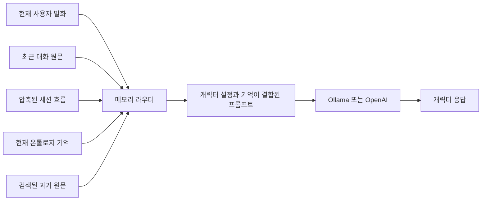

# Persona Universe

> 이미 자기 인격을 가진 AI 캐릭터와 대화하고, 그 캐릭터가 나와 우리의 관계를 어떻게 기억하는지 3D 온톨로지 그래프로 들여다보는 로컬 퍼스트 애플리케이션입니다.

Persona Universe의 목표는 대화 기록을 단순히 다시 보여주는 것이 아닙니다. 이름, 취향, 감정, 일, 목표, 정정된 사실과 둘 사이의 대화 방식이 **의미 있는 개체와 관계**로 연결되고, 캐릭터가 그 기억을 실제 답변에 사용하도록 만드는 것이 핵심입니다.

- 로그인 없이 로컬에서 실행합니다.
- Ollama와 OpenAI를 모두 사용할 수 있습니다.
- 캐릭터마다 대화, 기억, 관계 그래프가 완전히 분리됩니다.
- 원문 대화가 아니라 추출된 기억만 기본 그래프에 표시됩니다.
- RDF/OWL 어휘, 온톨로지 assertion, SPARQL 조회와 도메인 추론을 실제 저장 계층으로 사용합니다.

## 제품이 보여주는 것

### 캐릭터

캐릭터는 대화를 통해 뒤늦게 인격을 조립하는 빈 챗봇이 아닙니다. 나이, 직업, 배경, 성격, 취향, 말투와 관계 방식이 이미 설정된 인물이며, 대화가 진행되면서 **사용자에 대한 기억과 둘 사이의 관계**가 추가됩니다.

기본 캐릭터 5명은 삭제할 수 없으며 기억만 초기화할 수 있습니다.

| 캐릭터 | 설정 | 성향 |
| --- | --- | --- |
| 서린 | 31살 · INFJ · 야간 기록가 | 감정과 생활 맥락을 차분하게 살핍니다. |
| 하온 | 27살 · ENFP · 커뮤니티 호스트 | 일상의 기분 변화와 소소한 취향을 잘 이어갑니다. |
| 이안 | 36살 · INTJ · 서비스 전략가 | 목표, 제약, 결정사항을 실행 가능한 구조로 정리합니다. |
| 미로 | 25살 · INFP · 콘셉트 아티스트 | 취향과 프로젝트 맥락을 창작 아이디어로 확장합니다. |
| 노아 | 33살 · ISTJ · 루틴 코치 | 현재 상태를 인정하면서 작은 다음 행동을 찾습니다. |

사용자 캐릭터는 직접 만들거나, 한 줄 콘셉트를 Ollama/OpenAI에 전달해 자동 생성할 수 있습니다. 생성 결과에는 이름, 나이, MBTI, 직업, 배경, 성격, 특징, 강점, 조심하는 점, 취향, 말투와 관계 방식이 포함됩니다.

### 대화

- Enter 전송, Shift+Enter 줄바꿈
- 캐릭터별 복수 대화 세션
- 응답 생성 상태와 경과 시간 표시
- 캐릭터별 말투와 관계 합의 유지
- 긴 대화를 위한 세션 압축
- "내가 아까 뭐라고 했지?" 같은 질문을 위한 원문 검색
- 현재 사실, 취향, 감정과 목표를 온톨로지에서 찾아 답변에 반영

### 기억 우주

- 마우스 회전, 이동, 확대/축소
- 노드 드래그와 위치 고정
- 노드/엣지 호버 요약
- 클릭한 기억의 내용과 연결 맥락 확인
- `나와 우리`, `마음`, `일과 생활`, `관심과 목표`, `캐릭터`, `전체 기억` 보기
- 데스크톱·태블릿·모바일 반응형 화면
- 모바일 `대화 / 기억` 화면 전환

내부 점수, RDF 식별자, assertion 개수 같은 개발자 정보는 제품 UI에 노출하지 않습니다.

## 빠른 시작

### 요구사항

- Node.js 22.5 이상 (`node:sqlite` 사용)
- npm
- Ollama 또는 OpenAI API 키 중 하나

Ollama와 OpenAI는 둘 다 필수가 아닙니다. 로컬 Ollama만으로 모든 주요 기능을 사용할 수 있습니다.

### 개발 모드

```bash
git clone https://github.com/Gyu-BBB/persona-universe.git
cd persona-universe
npm install
npm run dev
```

브라우저에서 [http://127.0.0.1:5173](http://127.0.0.1:5173)을 엽니다.

- Frontend: `http://127.0.0.1:5173`
- API: `http://127.0.0.1:5174`
- SQLite: `data/persona-universe.sqlite`

### 프로덕션 빌드

```bash
npm run build
npm run start
```

프로덕션 모드에서는 API 서버가 `dist`도 함께 제공하므로 [http://127.0.0.1:5174](http://127.0.0.1:5174)로 접속합니다.

## 모델 설정

### Ollama

로컬 Ollama가 실행 중이면 앱이 사용 가능한 모델을 자동으로 찾습니다.

```bash
ollama list
ollama pull gemma4:12b
```

기본값을 바꾸려면 서버 실행 전에 환경변수를 지정합니다.

```bash
export OLLAMA_BASE_URL=http://127.0.0.1:11434
export OLLAMA_MODEL=gemma4:12b
npm run dev
```

### OpenAI

OpenAI 설정은 UI에서 관리합니다.

1. 대화 영역의 설정 아이콘을 엽니다.
2. `OpenAI`를 선택합니다.
3. API 키와 모델 이름을 입력합니다.
4. `저장하고 확인`을 누릅니다.

저장 후 선택한 모델에 실제로 접근할 수 있는지 확인하며, 성공하면 대화 provider가 OpenAI로 전환됩니다. 저장된 키는 다시 화면에 표시하지 않고 마지막 네 글자만 `••••1234` 형태로 보여줍니다.

환경변수도 fallback으로 사용할 수 있습니다.

```bash
export OPENAI_API_KEY=sk-...
export OPENAI_MODEL=gpt-4o-mini
npm run dev
```

UI에서 저장한 값이 같은 환경변수보다 우선합니다.

### 전체 환경변수

| 변수 | 기본값 | 설명 |
| --- | --- | --- |
| `PORT` | `5174` | API 및 프로덕션 정적 서버 포트 |
| `VITE_API_BASE` | `/api` | 프런트엔드 API 기준 경로 |
| `OLLAMA_BASE_URL` | `http://127.0.0.1:11434` | Ollama API 주소 |
| `OLLAMA_MODEL` | `gemma4:12b` | 기본 Ollama 모델 |
| `OPENAI_API_KEY` | 없음 | UI 설정이 없을 때 사용할 OpenAI 키 |
| `OPENAI_MODEL` | `gpt-4o-mini` | UI 설정이 없을 때 사용할 OpenAI 모델 |
| `PERSONA_DB_PATH` | `./data/persona-universe.sqlite` | SQLite 파일 경로 |

## 기본 사용 흐름

1. 왼쪽 상단의 현재 캐릭터를 눌러 캐릭터 보관함을 엽니다.
2. 기본 캐릭터 또는 내 캐릭터를 검색하고 선택합니다.
3. 대화를 시작합니다. 새로 알게 된 사용자 정보와 관계 합의가 해당 캐릭터의 기억에만 저장됩니다.
4. 중앙 기억 우주에서 기억 보기 범위를 선택합니다.
5. 노드에 마우스를 올리면 짧은 기억을, 클릭하면 연결된 맥락을 확인할 수 있습니다.
6. 잘못 기억한 사실은 대화에서 자연스럽게 정정합니다. 예: `정정할게. 내 나이는 31살이야.`

캐릭터 보관함은 기본/사용자 캐릭터를 구분하고, 이름·직업·MBTI·성격·설명으로 검색할 수 있습니다. 사용자 캐릭터는 삭제할 수 있으며, 기본 캐릭터는 삭제할 수 없습니다.

## 기억 시스템

### 대화 컨텍스트 구성

모든 질문에 전체 대화 기록을 무조건 넣지 않습니다. 질문의 성격에 따라 필요한 기억을 조합합니다.



| 메모리 소스 | 역할 |
| --- | --- |
| 최근 대화 | 지시어, 직전 질문, 말의 흐름 유지 |
| 세션 압축 | 길어진 대화의 주제, 결정사항, 진행 상태 유지 |
| 온톨로지 기억 | 현재 사실, 취향, 감정, 목표, 관계 방식 제공 |
| 원문 검색 | 사용자가 과거 발화나 정확한 표현을 물을 때 사용 |

현재 사실과 최근 대화가 충돌하면 현재 온톨로지 기억을 우선합니다. 이전 값은 사용자가 정정 이력을 물을 때만 설명합니다.

### 온톨로지 저장 구조

SQLite는 단순 그래프 모양을 흉내 내기 위한 저장소가 아니라, 다음 의미 계층을 지속시키는 기반입니다.

- 타입이 지정된 기억 노드와 의미 관계
- 사용자, 캐릭터, 둘 사이의 관계 개체 분리
- 페르소나별 named graph 격리
- ontology class와 object/functional property
- current/replaced/historical 상태의 ontology assertion
- RDF triple과 Turtle export
- SPARQL `SELECT ... WHERE` 부분집합
- RDFS subclass/domain/range 추론
- functional property 충돌, 타입 누락, 잘못된 domain/range, 페르소나 간 연결 검사

현재 reasoner와 SPARQL 구현은 Persona Universe 도메인에 맞춘 경량 구현입니다. 범용 OWL DL reasoner나 전체 SPARQL 1.1 엔진을 표방하지 않습니다.

### 정정과 이력

사용자가 `30살`이라고 말했다가 `31살`이라고 정정하면 현재 응답에는 31살만 사용됩니다. 30살은 삭제하지 않고 정정 이력으로 남습니다.

```text
사용자 --has_age(current)--> 나이: 31살
사용자 --has_age(replaced)--> 나이: 30살
나이: 30살 --superseded_by--> 나이: 31살
나이: 31살 --updates_memory--> 나이: 30살
```

이름, 나이, 직업, MBTI, 둘 사이의 합의된 말투처럼 하나의 현재값만 가져야 하는 속성은 functional property로 검증합니다.

### 기억 그래프 표시 원칙

- 기본 그래프는 현재 캐릭터가 기억하는 사용자와 관계를 보여줍니다.
- 대화 원문, turn/session 보조 노드는 장기 기억처럼 표시하지 않습니다.
- 캐릭터 자체 설정은 `캐릭터` 보기에서 분리합니다.
- 호버에는 기억의 핵심만 표시합니다.
- 자세한 관계와 정정 상태는 선택 후 기억 노트에서 보여줍니다.

## 프로젝트 구조

```text
persona-universe/
├── src/
│   ├── App.jsx                       # 화면 상태와 주요 사용자 흐름
│   ├── components/
│   │   ├── ChatPanel.jsx             # 대화, 세션, provider 설정
│   │   ├── PersonaLibrary.jsx        # 캐릭터 검색과 선택
│   │   ├── PersonaStudio.jsx         # 수동/자동 캐릭터 생성
│   │   ├── MemoryUniverse.jsx        # Three.js 3D 기억 그래프
│   │   ├── SummaryPanel.jsx          # 사용자/관계 기억 요약
│   │   └── NodeInspector.jsx         # 선택한 기억의 연결 맥락
│   └── lib/api.js
├── server/
│   ├── index.js                      # Express API
│   ├── db/                           # SQLite 연결과 스키마
│   ├── llm/                          # Ollama/OpenAI provider
│   ├── memory/
│   │   ├── memoryEngine.js           # 기억 수집, 라우팅, 응답 컨텍스트
│   │   ├── ontologyExtractor.js      # 대화에서 기억 후보 추출
│   │   ├── ontologySchema.js         # 클래스, 속성, 제약 정의
│   │   └── ontologyStore.js          # assertion, RDF, SPARQL, 추론
│   ├── persona/characterGenerator.js # LLM 캐릭터 자동 생성
│   └── settings/appSettingsStore.js  # 로컬 provider 설정
├── scripts/                          # 회귀/시각/실모델 검증
├── docs/PRODUCT_PLAN.md
└── data/                             # 로컬 실행 데이터, Git 제외
```

## 주요 API

| Method | Endpoint | 설명 |
| --- | --- | --- |
| `GET` | `/api/bootstrap` | 현재 캐릭터, 세션, 메시지, 그래프와 모델 상태 |
| `POST` | `/api/chat` | 대화 처리, 기억 갱신, 캐릭터 응답 |
| `POST` | `/api/personas` | 사용자 캐릭터 생성 |
| `POST` | `/api/personas/generate` | LLM으로 캐릭터 설정 자동 생성 |
| `POST` | `/api/personas/:id/reset` | 해당 캐릭터의 대화와 기억 초기화 |
| `DELETE` | `/api/personas/:id` | 사용자 캐릭터 삭제 |
| `PUT` | `/api/settings/openai` | OpenAI 키/모델 로컬 저장 또는 키 삭제 |
| `POST` | `/api/settings/openai/test` | 저장된 OpenAI 설정 연결 확인 |
| `GET` | `/api/ontology/validate` | 현재 페르소나 온톨로지 무결성 검사 |
| `GET` | `/api/ontology/export` | Turtle 형식 온톨로지 내보내기 |
| `POST` | `/api/sparql` | 현재 페르소나 graph에 SPARQL SELECT 실행 |

서버는 기본적으로 `127.0.0.1`에만 바인딩됩니다.

## 데이터와 보안

- 로그인이나 외부 사용자 계정이 없습니다.
- 캐릭터, 대화, 기억, RDF triple과 앱 설정은 기본적으로 `data/persona-universe.sqlite`에 저장됩니다.
- 데이터베이스 파일은 지원되는 운영체제에서 현재 OS 사용자만 읽고 쓸 수 있도록 `600` 권한을 적용합니다.
- OpenAI API 키 전체는 저장 후 API 응답이나 UI로 다시 반환하지 않습니다.
- 현재 API 키 저장은 OS Keychain이나 별도 암호화를 사용하지 않는 로컬 SQLite 저장입니다. 공유 계정, 디스크 백업, 악성 로컬 프로세스로부터 키를 보호해야 하는 환경에서는 별도 secret manager가 필요합니다.
- `.env`, `data/`, SQLite 파일, 빌드 결과와 시각 테스트 이미지는 Git에서 제외됩니다.

데이터를 백업하려면 서버를 종료한 뒤 `data/persona-universe.sqlite`를 복사합니다. WAL 모드로 실행되므로 서버 실행 중에는 SQLite 파일 하나만 임의로 복사하지 않는 편이 안전합니다.

## 검증

### 빠른 API/Ollama 점검

API 서버가 실행 중이어야 합니다.

```bash
npm run dev:server
npm run smoke
```

### 자동 회귀 검사

```bash
npm run character-generation-check
npm run openai-settings-check
npm run product-behavior-check
npm run ontology-check
npm run memory-routing-check
npm run visual-check
npm run build
```

| 명령 | 확인하는 내용 |
| --- | --- |
| `character-generation-check` | 자동 생성 필드와 MBTI 정규화 |
| `openai-settings-check` | 키 저장, 마스킹, 재시작 지속성, 연결 확인, 삭제 |
| `product-behavior-check` | 기본/사용자 캐릭터, 감정 기억, 삭제/초기화 |
| `ontology-check` | 깊은 기억 연결, 정정, assertion, SPARQL, 추론 |
| `memory-routing-check` | 최근 대화, 세션 압축, 온톨로지, 원문 검색 선택 |
| `visual-check` | 데스크톱/태블릿/모바일 UI와 3D 그래프 상호작용 |

### 실제 Ollama 12턴 검사

```bash
npm run ollama-multiturn-check
```

로컬 Ollama 모델을 실제로 호출해 12턴 대화, 세션 압축, 정정, 원문 회상, 최종 온톨로지 무결성을 확인합니다. 모델과 장비에 따라 시간이 오래 걸릴 수 있습니다.

## 현재 범위

- 로컬 단일 사용자 제품입니다. 로그인, 동기화, 다중 사용자 권한은 제공하지 않습니다.
- OpenAI provider는 현재 Chat Completions API를 사용합니다.
- SPARQL은 현재 제품 검증에 필요한 `SELECT ... WHERE` 부분집합입니다.
- reasoner는 RDFS와 제품 도메인 규칙을 중심으로 한 경량 구현입니다.
- LLM 캐릭터 생성 품질과 기억 추출 품질은 선택한 모델의 한국어 성능에 영향을 받습니다.
- 매우 큰 그래프에서는 3D 렌더링과 force simulation 최적화가 추가로 필요할 수 있습니다.

제품 원칙과 이후 계획은 [docs/PRODUCT_PLAN.md](docs/PRODUCT_PLAN.md)에서 확인할 수 있습니다.
